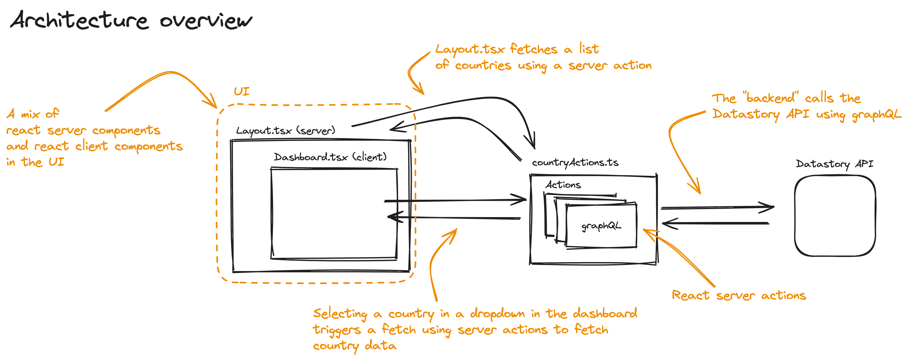

## Getting Started

First, run the development server:

```bash

pnpm dev

```

Open [http://localhost:3000](http://localhost:3000) with your browser to see the result.

## Architecture



### User interface

The application uses a mix of React Server Components and React Client Components to improve performance in the UI.

A mix of Chakra UI and Tailwind are used to give highflexibility coupled with fast development speed. Use of a higher level UI library could have been used but I prefer a lower level library for more finegrained control.

For the visualisations Visx was used. The same prinicple applies here, the library is quite low level since it allows for better control. An data visualisation architecture inspired by the Svelte visualisation library LayerCake was implemented to speed up development.

### Data fetching

Fetching data uses React Server Actions which removes the need for alternative BFF/proxy pattern that is/has been common in NextJS apps.
